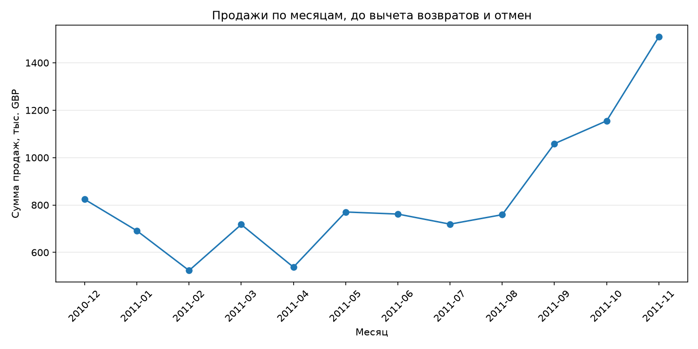
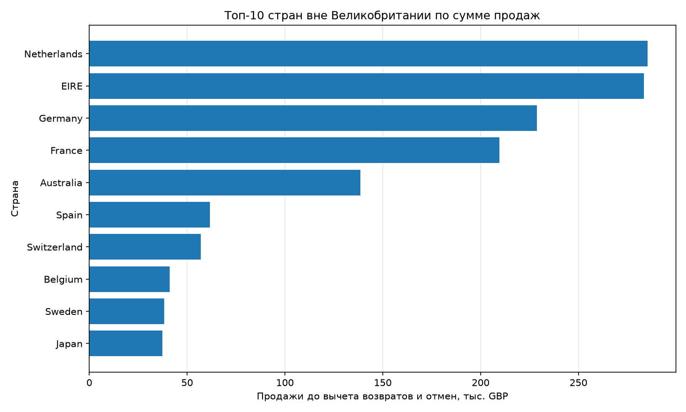
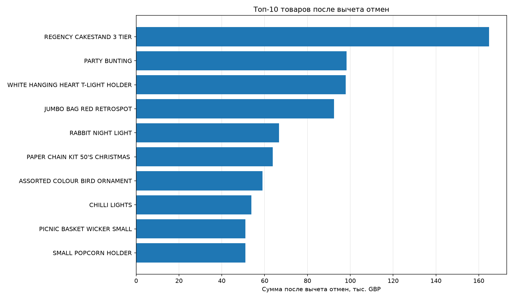

# Анализ продаж интернет-магазина

Учебный аналитический проект на Python: исследование продаж,
географии покупателей и влияния отмен на товарный рейтинг.

Инструменты: Python, pandas, matplotlib, openpyxl.

## Задачи

- Проверить качество исходных данных.
- Рассчитать сумму продаж, количество заказов и средний чек.
- Исследовать динамику продаж и распределение по странам.
- Сравнить товарный рейтинг до и после вычета отмен.

## Данные

Набор Online Retail из UCI Machine Learning Repository:
541 909 строк, 8 столбцов, период с 1 декабря 2010 года
по 9 декабря 2011 года. Денежные суммы указаны в GBP.

Одна строка соответствует позиции документа, а не целому заказу.

Источник: [Online Retail](https://archive.ics.uci.edu/dataset/352/online%2Bretail).

Автор данных: Daqing Chen (2015).
DOI: https://doi.org/10.24432/C5BW33.
Лицензия данных: [CC BY 4.0](https://creativecommons.org/licenses/by/4.0/).

В проекте выполнены фильтрация и агрегация исходных данных.

## Основные результаты

| Показатель | Значение |
|---|---:|
| Продажи до вычета отмен | 10 666 684,54 GBP |
| Сумма отмен | 896 812,49 GBP |
| Сальдо продаж и отмен за период | 9 769 872,05 GBP |
| Количество заказов до учёта отмен | 19 960 |
| Средний чек до вычета отмен | 534,40 GBP |
| Доля Великобритании до вычета отмен | 84,61% |

### Выводы

1. Продажи сосредоточены на внутреннем рынке: на Великобританию
   приходится 84,61% суммы до вычета отмен. Крупнейшие зарубежные
   рынки по этому показателю: Нидерланды и Ирландия.

2. Максимальная сумма продаж среди полных месяцев наблюдается
   в ноябре 2011 года: 1 509 496,33 GBP до вычета отмен.
   Одного годового цикла недостаточно для уверенного вывода
   о повторяющейся сезонности.

3. Отмены существенно меняют товарный рейтинг. Продажа товара
   PAPER CRAFT, LITTLE BIRDIE на 168 469,60 GBP имеет
   соответствующую отмену через 12 минут. Анализ только
   положительных операций завышает результат этой позиции.

4. Лидер товарного рейтинга после вычета отмен и исключения
   кодов DOT, POST, M: REGENCY CAKESTAND 3 TIER.
   Итоговая сумма составляет 164 762,19 GBP.

5. Удаление полных повторов из таблицы положительных продаж
   уменьшает её сумму на 24 573,74 GBP, или 0,23%.
   Это оценка влияния повторов на общую сумму, а не доказательство
   того, что все повторяющиеся строки ошибочны.

## Правила расчёта и ограничения

- Продажи: Quantity > 0, UnitPrice > 0, номер документа
  не начинается с C.
- Отмены: номер документа начинается с C,
  Quantity < 0, UnitPrice > 0.
- Сумма строки: Quantity × UnitPrice.
- Число заказов: количество уникальных InvoiceNo
  в таблице положительных продаж.
- Средний чек: сумма положительных продаж / число заказов.
- Строки с нулевой или отрицательной ценой не входят в показатели.
- Пропуски CustomerID не исключаются из общих расчётов.
- Полные повторы сохраняются в основном анализе;
  их влияние проверяется отдельно.
- Из товарного рейтинга исключены DOT и POST, связанные
  с доставкой, и M с описанием Manual. Это не полная
  классификация всех служебных кодов. В общих показателях
  эти позиции сохраняются.
- Месячный и страновой графики показывают продажи до вычета
  отмен, товарный график учитывает отмены.
- Декабрь 2011 года исключён только из месячного графика
  как неполный месяц. В общих итогах и CSV он сохранён.
- Сальдо учитывает продажи и отмены по датам их регистрации.
  Каждая отмена не сопоставлялась с исходной продажей:
  покупка могла произойти до начала периода.
- Сальдо продаж и отмен не является прибылью.

## Графики

### Продажи по полным месяцам



### Крупнейшие зарубежные рынки



### Товары после вычета отмен



## Запуск

1. Установить Python и открыть папку проекта.
2. Создать виртуальное окружение и выбрать его интерпретатор.
3. Установить зависимости:

   ```bash
   python -m pip install -r requirements.txt
   ```

4. Скачать архив с данными по ссылке UCI выше, распаковать
   и положить файл `Online Retail.xlsx` в папку `data`.
5. Запустить:

   ```bash
   python main.py
   ```

При первом запуске Excel сохраняется в локальный кеш
`data/Online Retail.pkl`. Следующие запуски используют кеш,
если исходный Excel не обновился.

Кеш создаётся самим скриптом; загружать чужие pickle-файлы
для запуска проекта не требуется.

Для подробного вывода диагностики установить
`SHOW_DETAILS = True` в `main.py`.

## Результаты выполнения

Скрипт создаёт в папке `output`:

- `summary.csv`: основные показатели;
- `monthly_sales.csv`: продажи по месяцам до вычета отмен;
- `country_sales.csv`: продажи по странам до вычета отмен;
- `products_after_cancellations.csv`: рейтинг позиций
  после вычета отмен и исключения выбранных служебных кодов;
- три графика в формате PNG.